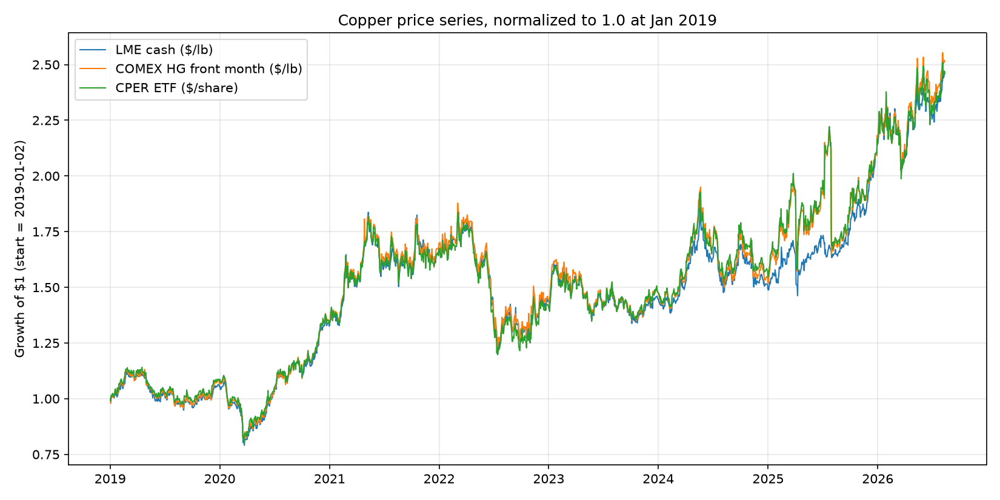
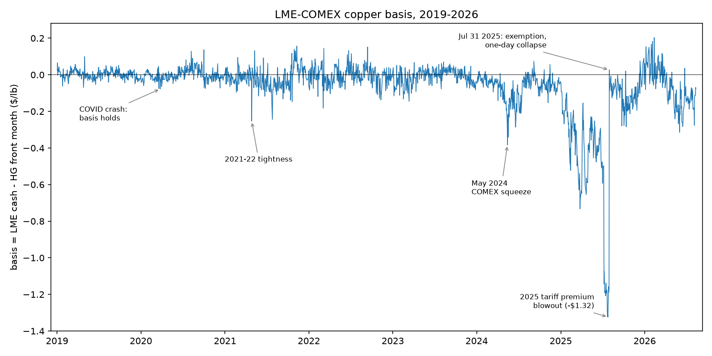
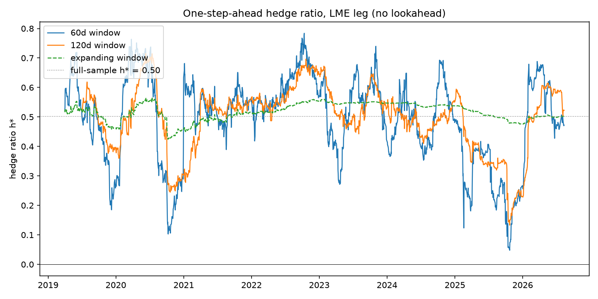
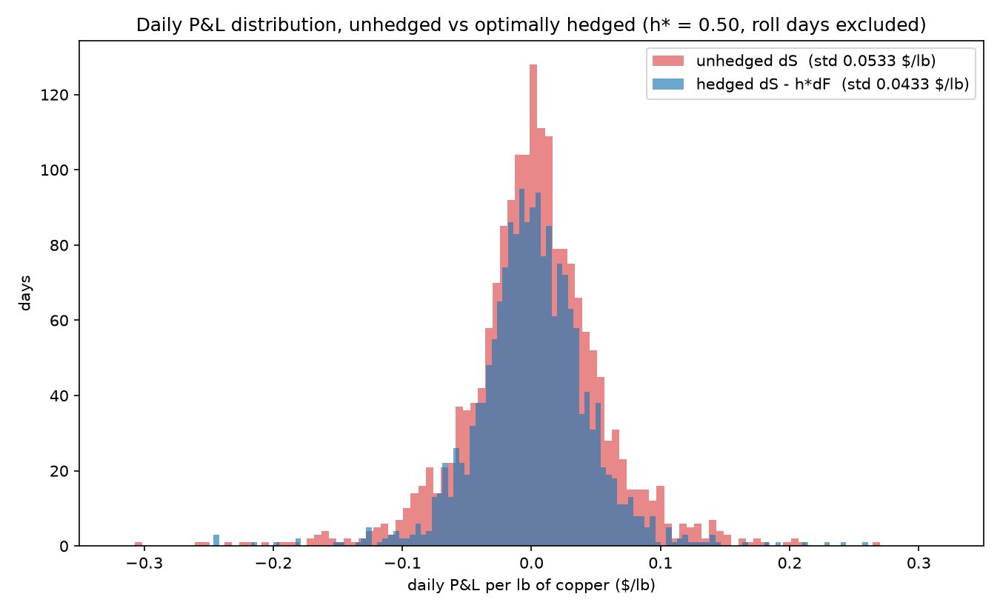

<h1 align="center">Copper Hedge &amp; Basis Analysis</h1>

<p align="center"><em>Minimum-variance hedging of physical copper with COMEX futures, measured honestly out of sample.</em></p>

<p align="center">
  
  
  
  
</p>

<p align="center">Project page: <a href="https://jesstran.co/projects/copper-hedge">jesstran.co/projects/copper-hedge</a></p>

How well does shorting COMEX copper futures hedge a physical copper position, and why is
the hedge never perfect? This project computes the minimum-variance hedge ratio of LME cash
copper against COMEX HG futures (with the CPER ETF as a secondary check), measures how much
risk the hedge actually removes both in-sample and strictly out-of-sample, and quantifies
the residual basis risk a hedger cannot escape, including what the May 2024 COMEX-LME
squeeze did to a short-futures hedger. All math lives in tested Python modules under
`src/copper_hedge/`; every number below is reproducible from the committed data.

**Contents:**
[Headline results](#headline-results) ·
[The four figures](#the-four-figures) ·
[The finance, in one page](#the-finance-in-one-page) ·
[Data](#data) ·
[Results in detail](#results-in-detail) ·
[May 2024 squeeze](#case-study-may-2024-when-the-hedge-was-the-problem) ·
[2025 tariff collapse](#case-study-the-2025-tariff-premium-and-its-one-day-collapse) ·
[From ratio to contracts](#from-ratio-to-contracts) ·
[Limitations](#limitations) ·
[Reproducing the analysis](#reproducing-the-analysis)

## Headline results

The minimum-variance LME-COMEX hedge removes **33.1% to 33.8% of daily variance out of
sample**, while a naive 1:1 hedge removes only **0.6% on the same days**; the paired
in-sample result is **34.1%**, so the performance survives an honest forward test.
Measured Friday to Friday, effectiveness rises to **70.0%** as the London-New York
closing-time mismatch washes out. The remaining risk is economically meaningful:
optimal daily hedging still leaves residual volatility of **$0.0433/lb**, while the
daily change in the unhedged LME-COMEX basis has a standard deviation of **$0.0531/lb**.

| Result | Optimal hedge | Naive 1:1 comparison |
|---|---:|---:|
| Daily, in-sample (1,845 observations) | +34.1% | +0.7% |
| Daily OOS, 60-day window (1,785 days) | +33.5% | +0.6% on the same days |
| Daily OOS, 120-day window (1,725 days) | +33.1% | +0.6% on the same days |
| Daily OOS, expanding window (1,785 days) | +33.8% | +0.6% on the same days |
| Weekly, Friday to Friday (375 weeks) | +70.0% | +60.2% |
| Residual risk, daily standard deviation | $0.0433/lb | Basis change: $0.0531/lb |

## The four figures

### Three prices for one metal



All three copper exposures broadly travel together across **1,875 common trading
days from 2019-01-02 to 2026-08-12**, which is why a COMEX hedge can work at all.
The series trend upward overall, with a lull in 2019, the COVID drop and recovery in
2020, a slide in mid-2022, and a sharp spike in mid-2024. The visible separations, especially from 2024
onward, are the basis risk hidden by their similar long-run direction.

### The basis, and when it broke



The LME-minus-COMEX basis averages **-$0.0592/lb** and stays comparatively close to
zero through most of the sample, before the May 2024 squeeze and the much larger 2025
tariff dislocation. Its minimum, **-$1.3237/lb on 2025-07-25**, followed by the
annotated one-day collapse, shows how violently two prices for "copper" can part
company. The dislocations marked on the chart are analyzed in the case study below.

### The hedge ratio through time



The one-step-ahead hedge ratio changes through time: the 60-day estimate reacts most
and is the most volatile, the 120-day path is smoother, and the expanding estimate is
the most stable around the full-sample **h\* = 0.5025**. Despite those different
paths, the three specifications deliver tightly grouped out-of-sample effectiveness
of **+33.5%, +33.1%, and +33.8%**.

### What the hedge does to the P&L



The optimally hedged distribution is visibly narrower, with residual daily volatility
of **$0.0433/lb**, but the two distributions overlap heavily and the hedged series
keeps most of its tails: the hedge shrinks everyday risk by about a third, it does not
flatten the extremes. The modest narrowing is the same **+34.1%** in-sample variance
reduction that remains **+33.1% to +33.8%** out of sample, not a claim of a
near-perfect daily hedge.

## The finance, in one page

A company that owns physical copper loses money when the copper price falls. To
protect itself it can sell copper futures: if the price drops, the loss on the metal
it holds is offset by a gain on the futures it sold short. The catch is that the metal
it holds (LME cash copper in London) and the contract it sells (COMEX futures in New
York) are not the same thing, and their prices do not move in perfect lockstep. The
hedge cancels most of the price risk but never all of it, and that leftover is what
this project measures.

Three quantities do the work.

The **hedge ratio** `h* = Cov(ΔS, ΔF) / Var(ΔF)` answers "how many pounds of futures to
short per pound of physical held." `S` is the physical (LME) price, `F` the futures
(COMEX) price, and `ΔS`, `ΔF` their daily changes. `h*` is the value that minimizes the
variance of the combined position, and it is exactly the slope of a regression of `ΔS`
on `ΔF`. Here `h* = 0.5025`: close to one half, not one, which is itself a result worth
explaining.

**Hedge effectiveness** `e = 1 − Var(hedged) / Var(unhedged)` is the fraction of price
risk the hedge removes, where the hedged P&L is `ΔS − h*ΔF` and the unhedged P&L is `ΔS`
alone. In-sample, `e` equals the **R²** of that same regression, because the regression
picks `h*` precisely to explain as much of the variance of `ΔS` as possible, so
"variance explained" and "variance removed" are one number (34.1%, R² = 0.3405). Out of
sample they can diverge, which is why the honest forward test matters.

The **basis** `b = S − F` is the gap between the two prices on a given day. A hedge is
only as good as the stability of this gap: if the basis never moved, the hedge would be
perfect. For the dollar-for-dollar hedger the link is exact, not approximate: with
h = 1, daily P&L is `ΔS − ΔF = Δb`, the day's basis change, identically. **Basis risk**
is the variability of that gap, the risk no hedge ratio can remove, because it lives in
the difference between the two legs rather than in either leg alone. It is what the
residual $0.0433/lb and the -$1.3237/lb basis low on 2025-07-25 are measuring.

**A note on units.** Everything is computed on price *changes* in dollars per pound
(`$/lb`), not percentage returns. A hedger cares about dollars of P&L per physical pound
held, and futures trade in a fixed size per contract, so a hedge ratio in `$/lb` maps
directly onto a number of contracts. Putting both legs in the same units also makes
`h*` dimensionless, so a value near one would signal two prices for the same metal.
Returns would rescale each day's move by that day's price level, distorting the
minimum-variance ratio and breaking the clean link to contracts, so returns are
deliberately avoided.

## Data

Three daily copper series, all reduced to a common unit and aligned on shared trading
days.

| Series | Source | Role in the hedge |
|---|---|---|
| LME cash copper | Westmetall | physical proxy, the exposure being hedged (`S`) |
| COMEX HG front-month futures (`HG=F`) | yfinance | hedging instrument, what gets shorted (`F`) |
| CPER ETF | yfinance | secondary check, not the headline (itself holds copper futures) |

Conventions:

- **One unit throughout: `$/lb`.** LME is quoted in dollars per tonne and is divided by
  2,204.62 (pounds per tonne) so all three series are directly comparable.
- **Aligned by inner join** on common trading days, giving 1,875 days from 2019-01-02 to
  2026-08-12. The calendar mismatch drops 49 LME rows, 42 COMEX rows, and 36 CPER rows,
  and no gaps are forward-filled.
- **Outliers are kept.** The 2024 squeeze and 2025 tariff dislocation are signal, not
  noise to be cleaned away.
- **Futures roll days are excluded from the regressions.** When the HG front month rolls
  to the next contract, `F` jumps for a reason unrelated to copper's price, which would
  contaminate `Cov(ΔS, ΔF)`. Those days are detected with a price-gap heuristic checked
  against the COMEX active-month calendar (March, May, July, September, December),
  which flags 29 roll days across the sample; they are removed before estimation,
  leaving 1,845 in-sample daily observations. They stay in the price and basis plots,
  where they do no harm.

## Results in detail

The primary LME-COMEX hedge removed **34.1%** of daily variance in-sample, and the
honest one-step-ahead results remained close at **33.1% to 33.8%** out of sample. By
contrast, shorting one pound of COMEX copper for each pound of LME exposure removed
only **0.6%** on the same out-of-sample days. The small deterioration is consistent
with a relationship that is stable rather than overfit: the independently estimated
hedge ratio stays between 0.45 and 0.56 in all five market regimes below.

| Daily estimate | Observations | h\* | R² | Effectiveness | Naive 1:1, same days |
|---|---:|---:|---:|---:|---:|
| In-sample, full history | 1,845 | 0.5025 | 0.3405 | +34.1% | +0.7% |
| Out of sample, 60-day rolling | 1,785 | n/a | n/a | +33.5% | +0.6% |
| Out of sample, 120-day rolling | 1,725 | n/a | n/a | +33.1% | +0.6% |
| Out of sample, expanding | 1,785 | n/a | n/a | +33.8% | +0.6% |

Each out-of-sample row uses only information available before the day being hedged, so
no single h\* or R² describes it. The 60-day estimate adapts faster, the 120-day
estimate trades some responsiveness for a larger sample, and the expanding estimate
uses all prior observations; their near-identical results show that the headline is
not dependent on one window choice.

As a secondary check, the in-sample CPER-COMEX regression produces h\* = **5.7437**,
R² = **0.7215**, and effectiveness of **+72.2%**.¹ This is intentionally not the
headline: the strict out-of-sample exercise above uses the primary physical-copper
proxy, LME cash, and CPER itself holds copper futures.

¹ CPER's h\* is measured in dollars per share per dollar per pound, so its magnitude
is unit-dependent. Only its R² and effectiveness compare cleanly with the LME leg.

### Weekly re-run

The daily result understates the economic link. On **375** Friday-to-Friday weeks,
the in-sample hedge ratio rises to **0.7276** and effectiveness doubles to **+70.0%**
(R² **0.6996**); even the naive 1:1 hedge removes **+60.2%**. These weekly figures
provide timing context for, rather than replace, the daily out-of-sample result of
**+33.1% to +33.8%** versus **+0.6%** naive.

The reason is asynchronous closes. LME cash fixes around 1 p.m. London time, COMEX
around 1 p.m. New York time, and CPER at 4 p.m. New York. News arriving between those
closes can land in one leg's "day" before the other's, weakening same-day covariance.
Across a week that timing mismatch mostly washes out, so the measured relationship
strengthens and h\* moves closer to the one-for-one exposure of two copper prices.

### Five market regimes

| Regime | Observations | h\* | Daily effectiveness |
|---|---:|---:|---:|
| 2019 calm | 244 | 0.4618 | +26.6% |
| 2020 COVID | 246 | 0.4562 | +23.1% |
| 2021-23 tightness | 727 | 0.5639 | +35.4% |
| 2024 squeeze era | 242 | 0.5026 | +36.2% |
| 2025+ tariff era | 386 | 0.4524 | +34.6% |

Counterintuitively, the violent regimes hedge better at the daily frequency. The
closing-time mismatch is roughly constant in size, so it can dominate small moves in
calm markets but is swamped when both copper markets make large common moves. COVID
2020 is the clearest warning against reading its **+23.1%** daily result as a broken
hedge: its weekly correlation is approximately **0.92**, the highest of the five
regimes, showing that much of the weak daily score is a timing artifact. Across the
full sample, the narrow range of h\* also explains why the honest out-of-sample
results lose less than one percentage point relative to the **+34.1%** in-sample fit.

## Case study: May 2024, when the hedge was the problem

In mid-May 2024 a short squeeze hit COMEX copper. The setup was a delivery trap. High
financing costs had drained US exchange inventories, leaving the market with little
physical cushion, while investment funds bought copper futures aggressively on expected
demand from AI data centers, power grids, and electric vehicles. Physical desks stood
on the other side of that flow: short COMEX futures against cheaper overseas metal,
planning to ship it to the US and deliver it against their shorts. When the market
moved, the escape routes closed. Much of the world's spare metal was of brands not
registered for COMEX delivery, fresh sanctions on Russian metal had narrowed what the
LME system could supply, and ships from South America take weeks while margin calls
arrive daily. Unable to deliver, shorts had to buy their positions back, the curve
snapped into steep backwardation, and the US futures price tore away from the rest of
the world's copper. In the ten trading days from April 30 to May 14, the COMEX front month
rose **+$0.3890/lb** while LME cash rose only **+$0.0469/lb**. For a desk long 1,000
tonnes of physical copper and short COMEX futures dollar for dollar, the position
built to be safe became the problem: a mark-to-market loss of **-$0.3421/lb**, about
**-$754,097** in two weeks.

Then it unwound. From May 14 to May 31 the squeeze snapped back and the same hedged
position made **+$0.3018/lb**, or **+$665,286**. Measured over the whole calendar
month, May netted just **+$67,234**, a statement that reads as if nothing happened.
That wash-out is the trap, not the reassurance: the month-end number hides a two-week
drawdown of three quarters of a million dollars that the desk had to survive in real
time, funding margin calls at the bottom. Basis risk is not the risk of losing by
month end; it is the risk of having to live through the ride in between. And the
market was about to run the same experiment again, slower and much bigger.

## Case study: the 2025 tariff premium and its one-day collapse

Where May 2024 was a ten-day accident, 2025 was a seven-month policy trade. Early in
the year, traders came to expect that a US Section 232 investigation would end in a
50% tariff on imported refined copper. Anyone who could land cathode in a US
warehouse before the tariff hit would own tariff-free metal in a tariffed market, so
desks raced to ship copper in, and that buying pushed COMEX to a premium over LME
with no precedent in the sample. The basis ground steadily lower until it reached
**-$1.3237/lb on 2025-07-25**, the widest gap in seven and a half years of data. A
desk hedged dollar for dollar was dragged along the whole way: from January 2 to July
25 the position bled **-$1.2749/lb**, or **-$2,810,701** on 1,000 tonnes, at the
worst mark. Nothing about its copper had changed; it was simply short the expensive
leg of a spread that policy expectations kept stretching, posting margin against a
loss that grew for seven months.

Then the policy landed, and it landed sideways. On July 30 the administration
finalized the 50% tariff but exempted refined cathodes, applying it to semi-finished
goods like wire and pipe instead. The premise of the front-running trade disappeared
in an afternoon, and the cathode stacked in US warehouses turned from a prize into an
overhang of unneeded local supply. The premium collapsed, and between July 25 and
August 5 the same hedged position earned back **+$1.3036/lb**, or **+$2,873,867**.
The arc is May 2024 again, roughly four times larger with a one-day ending, and it
carries the same lesson: on paper the round trip nets out, but only the desk that
could fund seven months of growing margin calls was still there to collect it.

The July 30, 2026 cathode exemption resolved this dislocation, but the Section 232 framework remains in flux, so the LME–COMEX basis stays a live policy variable rather than a settled one which is the structural reason a physical desk cannot treat 2025 as a one-off.

## From ratio to contracts

The hedge ratio is a desk instruction: short 0.5025 lb of COMEX futures for every
pound of physical cathode held long. For a 1,000-tonne cathode position (2,204,620 lb)
that is about 1.1 million lb of futures to short, and at 25,000 lb per contract:
0.5025 × 2,204,620 / 25,000 = **44.31, so short 44 contracts**.
Rounding to a whole number of contracts under-hedges by **7,796 lb** and costs
**0.0017 percentage points** of effectiveness: at this position size, integer
contracts are a rounding error, not a constraint. Doing so removes **34.1%** of the
position's daily price variance in-sample and **33.1% to 33.8%** out of sample. The
naive 1:1 hedge would short **88 contracts**: twice the futures and twice the margin
for almost none of the daily risk reduction (**+0.6%** on the same days).

## Limitations

- **CPER is a futures-tracking proxy, not physical copper.** It holds COMEX futures
  itself, so its +72.2% effectiveness partly measures the hedge instrument hedging
  itself. That is why LME cash is the primary leg and CPER is only a robustness check.
- **HG=F is a spliced front-month series.** Contract rolls inject artificial jumps into
  the futures changes; a gap heuristic flags and excludes 29 roll days. The heuristic
  can also catch genuinely violent days that fall near roll windows, so part of the
  clean-sample lift comes from excluding real days. Per-contract data would do better.
- **Closes are not simultaneous.** COMEX settles around 1 p.m. New York, LME fixes
  around 1 p.m. London, and CPER closes at 4 p.m. New York. Daily correlations are
  mechanically attenuated by the timing mismatch, which is why the weekly numbers
  (+70.0% against +34.1% daily) are the fairer read of the hedge relationship.
- **LME and COMEX are different markets in grade and location.** LME warehouses hold
  Grade A cathode around the world; COMEX requires US-deliverable brands. 2024 and 2025
  proved the two can part company exactly when it matters most. That gap is the basis
  risk this project measures, but it also means the results do not transfer directly to
  a desk whose physical copper prices off a different benchmark.
- **Physical flows outside exchange reporting.** Off-warrant and unregistered
  stockpiles, and policy-driven hoarding such as the 2025 tariff front-running, move
  the basis in ways visible exchange inventory cannot explain. Their contribution to
  unhedgeable basis risk is real but not separately measured here.
- **One instrument, front month only.** No calendar spreads, no options, no FX leg;
  h\* here is a single-instrument answer.

## Reproducing the analysis

```bash
uv sync          # exact environment (Python >= 3.12, managed by uv)
uv run pytest    # 115 tests, all of the math is unit-tested
```

Committed CSVs under `data/` are the source of truth: LME cash was scraped once from
Westmetall, HG=F and CPER were pulled once from yfinance (raw unadjusted closes), and
nothing refetches on a normal run. The code splits by job:

| Module | Job |
|---|---|
| `data.py` | loads the CSVs, converts units, aligns the three series |
| `roll.py` | detects futures roll days |
| `hedge.py` | hedge ratios, effectiveness, the out-of-sample engine, the weekly and sub-period reports |
| `basis.py` | basis statistics and the case-study windows |

Every number above prints from the numbers-pack script in
`docs/phases/PHASE7_INSTRUCTIONS.md`, and the figure scripts live in
`scripts/` and the other `docs/phases/` instruction docs. The project was built
in test-first phases; the full process record, including the per-phase handoff
instructions, the decisions log, and the session-by-session worklog, lives
under [`docs/`](docs/).
